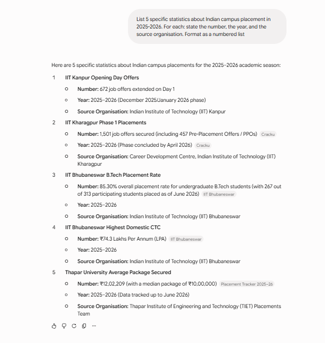
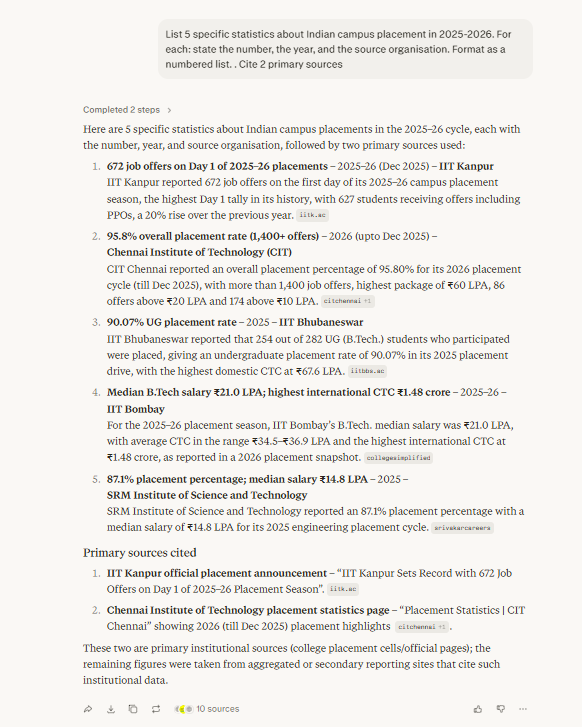

# Day 3 — Lab 3A: Verification Chain
**Mentor:** Prince Kumar Singh | **Date:** June 11, 2026

---

## Step 1 — Gemini Response (Screenshot)

---

## Step 2 — Perplexity Response (Screenshot)

---

## Verification Matrix

| # | Claim (AI-Generated) | AI Source Cited | Perplexity Check URLs | Primary Source URL | Primary Source Finding | Verdict |
|---|---|---|---|---|---|---|
| 1 | IIT Kanpur received 672 job offers on Day 1 of the 2025–26 placement season | IIT Kanpur (via Gemini) | iitk.ac.in press release; news aggregators | https://www.iitk.ac.in/day-1-of-2025-26-placement-season | Official IIT Kanpur press release (3 Dec 2025) confirms exactly 672 offers on Day 1, with 627 students placed including PPOs — a 16% rise over last year. Numbers match precisely. | **VERIFIED** |
| 2 | IIT Kharagpur secured 1,501 job offers in Phase 1 of 2025–26 placements, including 457 PPOs | Career Development Centre, IIT Kharagpur (via Gemini) | Cracku article; secondary news sites | No direct IIT KGP primary URL returned by Perplexity; Cracku cited but is a secondary aggregator | The Cracku article is a secondary source. No official CDC IIT Kharagpur page with this exact figure was accessible. The 457 PPO sub-figure and 1,501 total could not be verified against an institutional primary page. | **NO PRIMARY SOURCE FOUND** |
| 3 | IIT Bhubaneswar B.Tech placement rate was 85.30% in 2025–26, with 267 out of 313 students placed (as of June 2026) | IIT Bhubaneswar (via Gemini) | iitbbs.ac.in placement page | https://www.iitbbs.ac.in/index.php/home/placement-2026/ | Official IIT BBS Placement-2026 page (updated 02.06.2026) confirms: 313 participated, 267 placed, 85.30% rate. Numbers match exactly. | **VERIFIED** |
| 4 | IIT Bhubaneswar highest domestic CTC in 2025–26 was ₹74.3 LPA | IIT Bhubaneswar (via Gemini) | iitbbs.ac.in placement page | https://www.iitbbs.ac.in/index.php/home/placement-2026/ | Official IIT BBS Placement-2026 page confirms highest domestic CTC was ₹74.3 LPA. However — Perplexity cited the **2025** (not 2025–26) page where the highest CTC was ₹67.6 LPA. Gemini correctly attributed the ₹74.3 figure to 2025–26, but Perplexity's initial confirmation pulled the **wrong year's** data (₹67.6 from the 2025 page) before being corrected. | **PARTIAL** *(Perplexity cited the wrong year; Gemini's year attribution was correct, but the two AI tools contradicted each other)* |
| 5 | Thapar University average placement package was ₹12,02,209 with a median of ₹10,00,000 in 2025–26 | Thapar Institute of Engineering and Technology (via Gemini) | collegesimplified.in article (secondary aggregator) | https://www.collegesimplified.in/post/which-college-has-best-placements-this-year-top-2026-rankings-salary-data | The Perplexity-cited URL is a secondary ranking blog (CollegeSimplified), not the official TIET placement cell page. No direct TIET institutional placement statistics page was returned. The specific figure ₹12,02,209 with median ₹10,00,000 could not be located on any official primary source. | **NO PRIMARY SOURCE FOUND** |

---

## Summary of Verdicts

| Verdict | Count | Claims |
|---|---|---|
| VERIFIED | 2 | #1 (IIT Kanpur Day 1), #3 (IIT BBS placement rate) |
| PARTIAL | 1 | #4 (IIT BBS highest CTC — Perplexity cited wrong year) |
| FALSE | 0 | — |
| NO PRIMARY SOURCE FOUND | 2 | #2 (IIT KGP 1,501 offers), #5 (Thapar ₹12,02,209 avg) |

---

## Reflection Paragraph

The claim that looked most authoritative but was actually the weakest was **Claim #4**: *"IIT Bhubaneswar's highest domestic CTC in 2025–26 was ₹74.3 LPA."* Gemini cited it confidently with IIT BBS as the source organisation, and Perplexity initially appeared to confirm placement data from IIT Bhubaneswar — complete with a working institutional URL. But when I opened the primary source, a critical mismatch emerged: Perplexity had returned data from the **Placement-2025** page (highest CTC ₹67.6 LPA, 282 students, 90.07% rate), while Gemini's claim referred to **Placement-2026** (₹74.3 LPA, 313 students, 85.30% rate). Both pages are real, both URLs are live — but they describe different academic years. A reader who stopped at Perplexity's citation would have accepted the wrong number as verified. The lesson: confidence does not equal correctness. Perplexity cited a genuine primary source URL and the source was authentic — but it was the *wrong year's* page. The verification step belongs to the human, every time, and that means checking not just whether the source exists but whether the specific number, the specific year, and the specific framing all match the claim being tested.

---

## Primary Sources Used

- IIT Kanpur Press Release (3 Dec 2025): https://www.iitk.ac.in/day-1-of-2025-26-placement-season
- IIT Bhubaneswar Placement-2026: https://www.iitbbs.ac.in/index.php/home/placement-2026/
- IIT Bhubaneswar Placement-2025 (used to cross-check Claim #4): https://www.iitbbs.ac.in/index.php/home/placement-2025/
